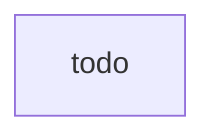
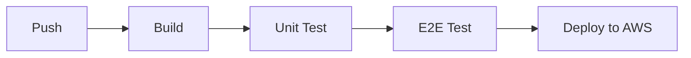

### Hi there 👋

# Portfolio

Welcome to my GitHub portfolio. This is where I showcase my technical ability and expertise.

## Architecture

Overview of my app, micro-frontend, and micro-service architecture.

## CI Development Pipeline

My development pipeline powered by GitHub Actions.

## Apps

### [Todo](https://github.com/griffinodow/todo)

My very first app. A todo list management web app based on React & Redux. Create lists, add tasks to lists, and mark them as complete.

## Micro-Frontends

## Micro-Services

## Libraries
